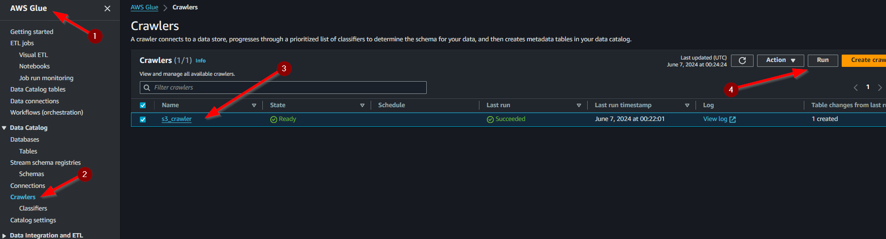

# Reto Técnico Handytec - Ingeniero Devops

Este reto técnico fue desarrollado para el puesto de Ingeniero Devops usando tenologias como Terraform y AWS.

## Objetivo del Proyecto

Aprovisionar la infraestructura necesaria para soportar una plataforma de datos en nube.

## Tecnologías Utilizadas

- Terraform
- AWS
    - VPC
    - IAM
    - Cognito
    - S3
    - AWS Glue
    - RDS
    - Secret Manager

## Detalle del Reto Técnico

1. Red virtual
2. Integrador de datos
3. Almacenamiento de tipo Data Lake
4. Base de datos relacional o analítica
5. Herramienta de autenticación y autorización de usuarios
6. Herramienta de administración de credenciales

## Despliegue
Para poder desplegar lo mencionado en el detalle del reto técnico simplemente debemos ubicarnos en la carpeta raiz donde se podrá encontrar el archivo [main.tf](main.tf) y ejecutar los siguientes comandos de terraform:

```console
# terraform init
# terraform plan
# terraform apply --auto-approve
```

Una vez se haya revisado el correcto funcionamiento de la infraestructura desplegada podemos proceder a eliminarla.

```console
# terraform destroy --auto-approve
```

## Documentación

### Red Virtual
Esta configuración de Terraform despliega una Virtual Private Cloud (VPC) en AWS para la Plataforma de Datos Handytec. La configuración incluye la creación de una VPC, subredes públicas y privadas, una puerta de enlace a Internet, una puerta de enlace NAT, tablas de rutas, un grupo de subredes para RDS y un grupo de seguridad para RDS.

El código de Terraform proporcionado realiza las siguientes acciones:

1. **Creación de VPC:**
    - Define una VPC con un bloque CIDR de `10.0.0.0/16`.
    - Etiqueta la VPC con metadatos relevantes, incluyendo el nombre del proyecto, el entorno y el equipo responsable.

2. **Subredes:**
    - Crea una subred pública y dos subredes privadas dentro de la VPC.
    - Asigna bloques CIDR a cada subred.
    - Etiqueta cada subred para su identificación.
    - Configura la subred pública para asignar direcciones IP públicas a las instancias al iniciarse.

3. **Puerta de Enlace a Internet:**
    - Crea una puerta de enlace a Internet y la adjunta a la VPC.
    - Etiqueta la puerta de enlace a Internet para su identificación.

4. **Tablas de Rutas:**
    - Crea una tabla de rutas para la subred pública, permitiendo el tráfico de salida a Internet a través de la puerta de enlace a Internet.
    - Asocia la subred pública con la tabla de rutas públicas.
    - Crea una tabla de rutas para las subredes privadas, permitiendo el tráfico de salida a Internet a través de una puerta de enlace NAT.
    - Asocia ambas subredes privadas con la tabla de rutas privadas.

5. **Puerta de Enlace NAT:**
    - Asigna una IP elástica (Elastic IP) para la puerta de enlace NAT.
    - Crea una puerta de enlace NAT en la subred pública.
    - Etiqueta la puerta de enlace NAT para su identificación.

6. **Grupo de Subredes para RDS:**
    - Crea un grupo de subredes para instancias RDS, utilizando las subredes privadas.
    - Etiqueta el grupo de subredes para su identificación.

7. **Grupo de Seguridad para RDS:**
    - Define un grupo de seguridad que permite el tráfico entrante de MySQL (puerto 3306) desde dentro de la VPC.
    - Permite todo el tráfico saliente desde el grupo de seguridad.
    - Etiqueta el grupo de seguridad para su identificación.

### Almacenamiento de tipo Data Lake
Esta configuración despliega y configura un bucket S3 en AWS para la Plataforma de Datos Handytec. La configuración incluye la creación de un bucket S3, una configuración de ciclo de vida del bucket, habilitación de logging, configuración de cifrado del lado del servidor y la implementación de una política de bucket para requerir solicitudes seguras.

El código de Terraform proporcionado realiza las siguientes acciones:

1. **Creación del Bucket S3:**
    - Define un bucket S3 con el nombre `handytec-bucket`.
    - Etiqueta el bucket con metadatos relevantes, incluyendo el entorno.
    - Habilita la eliminación forzada de objetos dentro del bucket.

2. **Configuración del Ciclo de Vida del Bucket:**
    - Crea una regla de ciclo de vida para el bucket, configurando la expiración de objetos después de 5 días.
    - Configura la transición de objetos a la clase de almacenamiento "GLACIER" después de 4 días.

3. **Habilitación de Logging:**
    - Habilita el logging para el bucket S3, enviando los logs a otro bucket denominado `handytec-log-bucket`.

4. **Configuración del Cifrado del Lado del Servidor:**
    - Configura el bucket para aplicar el cifrado del lado del servidor utilizando el algoritmo AES256.

5. **Política de Bucket:**
    - Define una política de bucket que deniega todas las solicitudes que no utilicen un transporte seguro (SSL/TLS).


### Integrador de Datos
Esta sección de la configuración de Terraform crea los roles y políticas necesarios para utilizar AWS Glue con permisos específicos para S3 y RDS. Además, configura un catálogo de base de datos de Glue y un Glue Crawler para acceder y clasificar los datos almacenados en S3.

1. **Documentos de Políticas IAM:**
    - Política de Glue: Permite que AWS Glue asuma roles mediante la acción `sts:AssumeRole`.
    - Política de S3: Permite todas las acciones (`s3:*`) en el bucket S3 utilizado como Data Lake.
    - Política de RDS: Permite diversas acciones de RDS (Describe, Create, Delete, Modify, Reboot) en todas las instancias y clusters.

2. **Roles y Políticas IAM:**
    - Rol de Servicio de Glue: Crea un rol IAM que AWS Glue puede asumir, utilizando la política AssumeRole definida.
    - Adjuntar Política de Servicio de Glue: Asocia el rol de Glue con la política gestionada `AWSGlueServiceRole`.
    - Política de Acceso a S3: Crea y adjunta una política personalizada al rol de Glue para permitir el acceso completo al bucket S3.
    - Política de Acceso a RDS: Crea y adjunta una política personalizada al rol de Glue para permitir acciones específicas en RDS.

3. **Configuración del Catálogo de Glue:**
    - Base de Datos de Glue: Crea un catálogo de base de datos de Glue denominado `s3_db_crawler`.
    - Clasificador de Glue: Define un clasificador CSV para el Glue Crawler, especificando detalles como la presencia de encabezados, delimitadores y símbolos de cotización.

4. **Glue Crawler:**
    - Crear el Crawler: Configura un Glue Crawler que utiliza el rol de servicio de Glue y accede al bucket S3 configurado, utilizando el clasificador definido para procesar los archivos CSV.


La configuración proporciona seguridad y control al definir políticas detalladas que aseguran que el rol de Glue tenga solo los permisos necesarios para operar en el entorno, minimizando riesgos de seguridad. Además, automatiza la identificación y catalogación de datos en el Data Lake mediante el Glue Crawler, mejorando la eficiencia y reduciendo la necesidad de intervención manual. Por último, ofrece flexibilidad al permitir el manejo de datos tanto en S3 como en RDS, proporcionando una solución integral para la gestión de datos en la Plataforma de Datos Handytec.

### Base de Datos Relacional o Analítica
Esta sección de la configuración de Terraform despliega una instancia de base de datos RDS utilizando MySQL en AWS. Incluye la creación de una contraseña aleatoria segura para el administrador de la base de datos.

1. **Instancia RDS:**
    - Identificador: La instancia de RDS se identifica como `handytec-rds-instance`.
    - Nombre de la Base de Datos: Se crea una base de datos llamada `handytecDB`.
    - Almacenamiento Asignado: La instancia tiene 20 GB de almacenamiento asignado.
    - Motor de Base de Datos: Se utiliza MySQL, versión 8.0.35.
    - Clase de Instancia: La clase de instancia es `db.t3.micro`, adecuada para cargas de trabajo pequeñas y de desarrollo.
    - Credenciales de Admin: El nombre de usuario es `admin` y la contraseña se genera de manera aleatoria.
    - Grupo de Parámetros: Utiliza el grupo de parámetros por defecto para MySQL 8.0 (`default.mysql8.0`).
    - Salto del Snapshot Final: No se crea un snapshot final al destruir la instancia (`skip_final_snapshot` está habilitado).
    - Grupos de Seguridad del VPC: La instancia utiliza el grupo de seguridad configurado (`aws_security_group.rds_sg.id`).
    - Grupo de Subnet RDS: La instancia se despliega en el grupo de subnets configurado para RDS (`aws_db_subnet_group.rds_subnet_group.name`).

2. **Generación de Contraseña Aleatoria:**
    - Longitud y Complejidad: Se genera una contraseña de 16 caracteres que incluye caracteres especiales para mejorar la seguridad.

La configuración proporciona un alto nivel de seguridad mediante la generación de una contraseña aleatoria y compleja para el acceso administrativo a la base de datos. Además, asegura una configuración óptima al utilizar parámetros y grupos de seguridad específicos según las mejores prácticas de AWS. La automatización de la configuración con Terraform permite el despliegue rápido y repetible de la infraestructura de base de datos, reduciendo errores y mejorando la eficiencia operativa. Asimismo, ofrece flexibilidad y escalabilidad, comenzando con una clase de instancia de bajo costo db.t3.micro y permitiendo la posibilidad de escalar según las necesidades del proyecto.

### Herramienta de Administración de Credenciales
Esta sección de la configuración de Terraform gestiona los secretos de la instancia RDS utilizando AWS Secrets Manager. Incluye la creación de un secreto y el almacenamiento de la versión actual del secreto que contiene las credenciales y detalles de conexión de la instancia RDS.

1. **Secretos de AWS Secrets Manager:**
    - Creación del Secreto:
        - Nombre: El secreto se denomina `rds-secret`.
        - Descripción: Se describe como `RDS Instance Secret`.
        - Ventana de Recuperación: Configurada a 0 días, lo que implica la eliminación inmediata del secreto si se elimina.

2. **Versión del Secreto:**
    - Almacenamiento de Credenciales:
        - Identificador del Secreto: Se refiere al secreto creado previamente.
        - Cadena de Secreto: Almacena las credenciales y detalles de conexión de la instancia RDS en formato JSON, incluyendo:
            - `username`: Nombre de usuario administrativo (`admin`).
            - `password`: Contraseña generada aleatoriamente para la base de datos.
            - `engine`: Motor de base de datos (`mysql`).
            - `host`: Dirección de la instancia RDS.
            - `port`: Puerto de conexión de la instancia RDS.
            - `dbname`: Nombre de la base de datos (`handytecDB`).

La configuración proporciona un almacenamiento seguro y gestionado de las credenciales y detalles de conexión de la instancia RDS mediante AWS Secrets Manager. Esto mejora significativamente la seguridad al evitar el almacenamiento de credenciales en texto plano en el código o archivos de configuración. Además, facilita la rotación y gestión de secretos, permitiendo actualizaciones sin necesidad de modificar la infraestructura.

### Herramienta de Autenticación y Autorización de Usuarios
Esta sección de la configuración de Terraform implementa la autenticación y autorización de usuarios utilizando AWS Cognito. Además de configurar la autenticación y autorización, también se ha configurado un cliente de aplicación para demostrar cómo se puede integrar Cognito con aplicaciones.

1. **AWS Cognito User Pool:**
   - **Nombre**: Se crea un User Pool llamado `handytec_user_pool`.
   - **Atributos de Nombre de Usuario**: Los usuarios pueden iniciar sesión con su correo electrónico.
   - **Configuración de Nombre de Usuario**: No es sensible a mayúsculas.
   - **Política de Contraseña**: Las contraseñas deben tener al menos 8 caracteres y deben incluir letras minúsculas, mayúsculas, números y símbolos.
   - **MFA**: Deshabilitado.
   - **Configuración de Recuperación de Cuenta**: Permite la recuperación mediante correo electrónico verificado y número de teléfono verificado.
   - **Esquema de Atributos**: Define varios atributos obligatorios y opcionales como correo electrónico, nombre, nombre de usuario preferido, número de teléfono, información personal y rol.

2. **AWS Cognito User Pool Client:**
   - **Nombre**: `handytec_app_client`.
   - **Flujos OAuth Permitidos**: `code` e `implicit`.
   - **Alcances OAuth Permitidos**: `phone`, `email`, `openid`, `profile` y `aws.cognito.signin.user.admin`.
   - **Flujos de Autenticación Explícitos**: Incluye flujos como `ALLOW_USER_SRP_AUTH`, `ALLOW_REFRESH_TOKEN_AUTH`, `ALLOW_CUSTOM_AUTH`, `ALLOW_USER_PASSWORD_AUTH` y `ALLOW_ADMIN_USER_PASSWORD_AUTH`.
   - **URLs de Callback y Logout**: Configuradas para la plataforma de datos Handytec.

3. **AWS Cognito User Pool Domain:**
   - **Dominio**: `handytec-user-pool-domain` asociado al User Pool creado.

4. **AWS Cognito Identity Pool:**
   - **Nombre**: `handytec_identity_pool`.
   - **Identidades No Autenticadas**: No permitidas.
   - **Proveedores de Identidad de Cognito**: Configurado con el User Pool y el User Pool Client creados anteriormente.

5. **Roles IAM:**
   - **Rol Autenticado**:
     - **Nombre**: `Cognito_handytec_authenticated`.
     - **Política de Asunción de Rol**: Permite a los usuarios autenticados de Cognito asumir este rol.
     - **Política Adjunta**: `AmazonCognitoPowerUser`.
   - **Rol No Autenticado**:
     - **Nombre**: `Cognito_handytec_unauthenticated`.
     - **Política de Asunción de Rol**: Permite a los usuarios no autenticados de Cognito asumir este rol.
     - **Política Adjunta**: `AmazonCognitoReadOnly`.


La configuración de AWS Cognito proporciona una solución robusta y segura para la autenticación y autorización de usuarios en la Plataforma de Datos Handytec. Al definir políticas de contraseña estrictas y mecanismos de recuperación de cuenta, se asegura la seguridad y facilidad de uso para los usuarios. Además, la configuración de un cliente de aplicación demuestra cómo integrar Cognito con aplicaciones, facilitando la gestión de sesiones y autenticación de usuarios. La asignación de roles IAM específicos para usuarios autenticados y no autenticados permite un control granular sobre los permisos y accesos, mejorando la seguridad general de la plataforma. 

### Arquitectura


La arquitectura de la plataforma de datos Handytec se basa en una infraestructura sólida y altamente escalable en la nube de Amazon Web Services (AWS). Esta arquitectura utiliza servicios clave de AWS para proporcionar una solución integral y segura para la gestión de datos.

En primer lugar, se despliega una Virtual Private Cloud (VPC) que actúa como un entorno aislado y privado en la nube de AWS. Dentro de esta VPC, se crean subredes públicas y privadas para segmentar y gestionar el tráfico de red de manera eficiente. Las subredes públicas permiten el acceso a Internet y se configuran para asignar direcciones IP públicas a las instancias que las utilizan. Por otro lado, las subredes privadas están protegidas y no tienen acceso directo a Internet.

Para permitir el acceso a Internet desde las subredes privadas, se implementa una puerta de enlace NAT (Network Address Translation). Esta puerta de enlace permite que las instancias en las subredes privadas accedan a recursos en Internet de manera segura y controlada.

Además, se establecen tablas de rutas para dirigir el tráfico dentro de la VPC de manera eficiente. Se configura una tabla de rutas pública para dirigir el tráfico de salida a Internet a través de la puerta de enlace a Internet, mientras que las subredes privadas utilizan una tabla de rutas privada que redirige el tráfico a través de la puerta de enlace NAT.

Para la gestión de datos, se utiliza un bucket S3 como un Data Lake para almacenar y procesar grandes volúmenes de datos de manera escalable y segura. Este bucket S3 se configura con políticas de ciclo de vida para gestionar la retención y el almacenamiento de los datos de manera eficiente.

Además, se despliega una instancia de base de datos relacional RDS (Amazon Relational Database Service) utilizando MySQL para almacenar datos estructurados de manera segura y altamente disponible. Esta instancia RDS se configura con una contraseña aleatoria generada automáticamente y se gestionan sus credenciales de acceso de manera segura utilizando AWS Secrets Manager.

Para la integración y clasificación de datos, se utiliza AWS Glue, un servicio de ETL (Extract, Transform, Load) que permite descubrir, catalogar y transformar datos almacenados en el Data Lake de S3. Se configura un Glue Crawler para identificar y clasificar los datos en el Data Lake de manera automática.

Finalmente, para la autenticación y autorización de usuarios, se utiliza AWS Cognito, un servicio de gestión de identidad que proporciona un sistema seguro y escalable para la autenticación de usuarios en la plataforma. Se configura un User Pool para gestionar usuarios y autenticar solicitudes, así como un Identity Pool para proporcionar acceso seguro a los servicios de AWS.

## Ejecución MultiEntorno

Este repositorio contiene los archivos necesarios para desplegar la infraestructura de la Plataforma de Datos Handytec en diferentes entornos utilizando Terraform.


Para desplegar la infraestructura en diferentes ambientes, utilizamos el módulo `data_platform_module` con configuraciones específicas para cada entorno.

1. **Entorno de Desarrollo**

```hcl
module "data_platform_dev" {
    source = "./data_platform_module"
    
    environment = "dev"
    company     = "handytec"
    project     = "data_platform"
}
```

2. **Entorno de Producción**

```hcl
module "data_platform_dev" {
    source = "./data_platform_module"
    
    environment = "prod" #Se cambia el valor de environment
    company     = "handytec"
    project     = "data_platform"
}
```
Simplemente en el archivo [main.tf](main.tf) agregaríamos nuevamente la sección de `module` debajo del que ya existe pero cambiando el valor de `environment`.

## Pruebas

Una vez desplegada la infraestructura podemos probar el integrador de datos subiendo un archivo a S3 en formato CSV y luego ejecutando el Crawler de AWS GLUE para poder extraer las cabeceras.

1. **Ir al servicio de S3 e ingresar al bucket**


2. **Cargar el archivo csv en el bucket**


3. **Ir a AWS Glue luego a Crawlers, seleccionar el crawler y  ejecutar**



**Esperar a que termine de correr el crawler**

4. **Ir a las tablas**


5. **Visualizar schemas**


## Puntos de Mejoras

1. **Uso de AWS Lambda**

Una posible mejora para fortalecer la seguridad y la gestión de credenciales en la plataforma es la integración de Amazon RDS con AWS Lambda y AWS Secrets Manager para facilitar la rotación automática de secretos.

Actualmente, la gestión de las credenciales de acceso a la instancia RDS se realiza de manera segura mediante AWS Secrets Manager, lo que garantiza el almacenamiento y el acceso seguro a las contraseñas de base de datos.

Sin embargo, para mejorar aún más la seguridad y cumplir con las mejores prácticas de gestión de secretos, se podría implementar un proceso automatizado de rotación de secretos utilizando AWS Lambda y AWS Secrets Manager. Esto permitiría rotar automáticamente las contraseñas de la instancia RDS en intervalos regulares o en respuesta a eventos específicos, como cambios en las políticas de seguridad o la detección de actividad inusual.

La integración de Lambda con Secrets Manager facilitaría la creación de funciones personalizadas que gestionen la rotación de secretos de manera segura y eficiente, sin necesidad de intervención manual. Esto mejoraría la seguridad al garantizar que las credenciales de acceso a la base de datos se actualicen periódicamente y se mantengan siempre protegidas contra posibles amenazas de seguridad.

Además, la automatización de la rotación de secretos reduciría la carga operativa y minimizaría el riesgo de errores humanos asociados con la gestión manual de credenciales. En conjunto, esta integración proporcionaría una capa adicional de seguridad y cumplimiento normativo a la plataforma, mejorando la confianza y la protección de los datos sensibles.

2. **Backends de terraform**

Una práctica recomendada al utilizar Terraform es configurar un backend remoto para almacenar el estado de la infraestructura gestionada. Amazon S3 y DynamoDB son opciones populares para este propósito debido a su confiabilidad, escalabilidad y disponibilidad.

Amazon S3 se utiliza para almacenar el archivo de estado de Terraform de forma segura y duradera. Proporciona una forma centralizada de gestionar y compartir el estado de la infraestructura entre miembros del equipo y entornos de desarrollo.

DynamoDB se utiliza como un bloqueo de bloqueo de estado para garantizar que solo un usuario o proceso modifique el estado de Terraform en un momento dado. Esto evita posibles conflictos y corrupción del estado cuando varios usuarios o procesos intentan modificar la infraestructura simultáneamente.

En conjunto, el uso de S3 y DynamoDB como backend para Terraform proporciona una solución robusta y segura para la gestión del estado de la infraestructura. Esto garantiza la coherencia y la integridad del estado de Terraform, lo que facilita la colaboración en equipos y la implementación automatizada de infraestructura.

## Authors

- [@JesquivelR](https://www.github.com/JesquivelR)